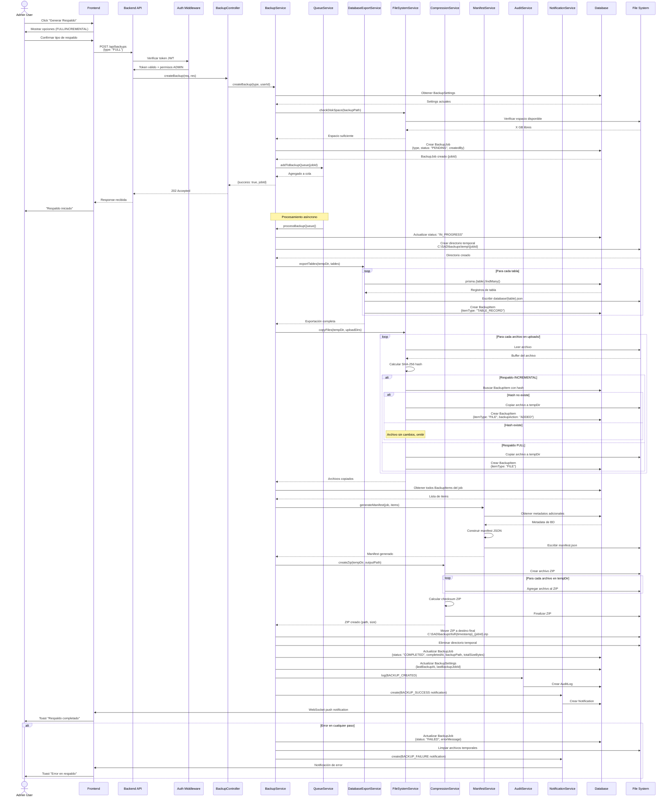
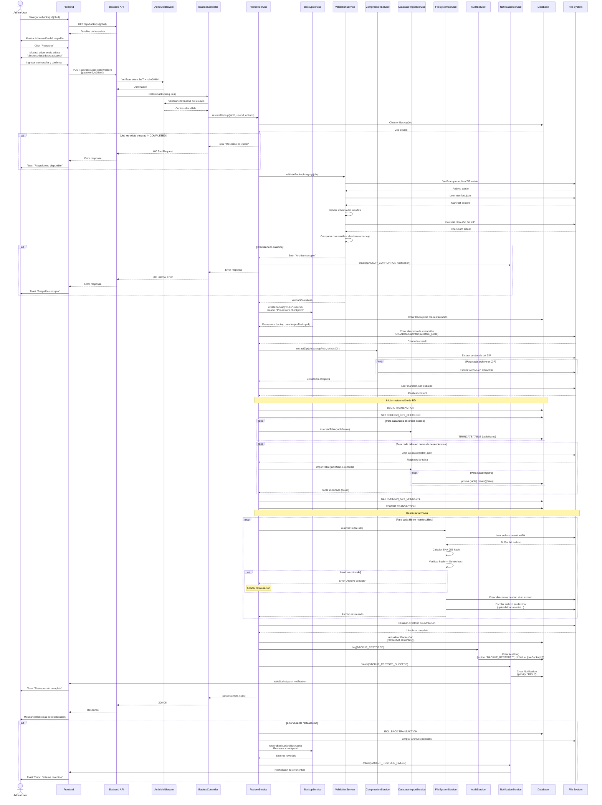

# Diagramas de Secuencia - Módulo de Copias de Seguridad

## 1. Diagrama de Secuencia: Generar Copia de Seguridad



---

## 2. Diagrama de Secuencia: Restaurar Respaldo



---

## 3. Diagrama de Componentes del Sistema

```
┌─────────────────────────────────────────────────────────────────┐
│                         FRONTEND                                 │
│  ┌────────────┐  ┌──────────────┐  ┌─────────────────┐         │
│  │ BackupList │  │ BackupConfig │  │ BackupDashboard │         │
│  │   Page     │  │    Page      │  │      Page       │         │
│  └────────────┘  └──────────────┘  └─────────────────┘         │
│         │               │                    │                   │
│         └───────────────┴────────────────────┘                   │
│                         │                                        │
│                 ┌───────▼────────┐                               │
│                 │  Backup Store  │ (Zustand)                     │
│                 │  (State Mgmt)  │                               │
│                 └───────┬────────┘                               │
│                         │                                        │
│                 ┌───────▼────────┐                               │
│                 │   API Client   │                               │
│                 └───────┬────────┘                               │
└─────────────────────────┼───────────────────────────────────────┘
                          │ HTTP/WebSocket
┌─────────────────────────▼───────────────────────────────────────┐
│                      BACKEND API                                 │
│  ┌────────────────────────────────────────────────────────┐     │
│  │              Express Routes & Controllers               │     │
│  │  /api/backups                                          │     │
│  │  /api/backups/:id                                      │     │
│  │  /api/backups/:id/restore                             │     │
│  │  /api/backups/settings                                │     │
│  └────────────────────┬───────────────────────────────────┘     │
│                       │                                          │
│  ┌────────────────────▼───────────────────────────────────┐     │
│  │                 BackupService                           │     │
│  │  - createBackup()    - restoreBackup()                 │     │
│  │  - listBackups()     - deleteBackup()                  │     │
│  │  - verifyBackup()    - cleanupOld()                    │     │
│  └────────┬─────────────────────────┬─────────────────────┘     │
│           │                         │                            │
│  ┌────────▼────────┐      ┌────────▼─────────┐                 │
│  │ QueueService    │      │ ValidationService│                 │
│  │ - addToQueue()  │      │ - validateIntegrity()               │
│  │ - processQueue()│      │ - verifyChecksums()                │
│  └────────┬────────┘      └──────────────────┘                 │
│           │                                                      │
│  ┌────────▼───────────────────────────────────────────────┐    │
│  │           Specialized Services Layer                    │    │
│  ├─────────────────┬──────────────┬──────────────────────┤    │
│  │DatabaseExport   │ FileSystem   │ Compression          │    │
│  │Service          │ Service      │ Service              │    │
│  │                 │              │                      │    │
│  │- exportTables() │- copyFiles() │- createZip()         │    │
│  │- importTables() │- calcHash()  │- extractZip()        │    │
│  └─────────────────┴──────────────┴──────────────────────┘    │
│           │                │                │                   │
│  ┌────────▼────────┐  ┌───▼────┐   ┌──────▼────────┐          │
│  │ ManifestService │  │ Audit  │   │ Notification  │          │
│  │ - generate()    │  │Service │   │  Service      │          │
│  │ - validate()    │  └────────┘   └───────────────┘          │
│  └─────────────────┘                                           │
│           │                                                     │
└───────────┼─────────────────────────────────────────────────────┘
            │
┌───────────▼─────────────────────────────────────────────────────┐
│                    PERSISTENCE LAYER                             │
│  ┌──────────────┐           ┌─────────────────────────┐         │
│  │   MySQL DB   │           │      File System        │         │
│  │              │           │                         │         │
│  │ - BackupJob  │           │ C:\SAD\backups\         │         │
│  │ - BackupItem │           │   ├─ full\              │         │
│  │ - Settings   │           │   ├─ incremental\       │         │
│  │ - All tables │           │   └─ temp\              │         │
│  │              │           │                         │         │
│  └──────────────┘           │ uploads\                │         │
│                             │   ├─ documents\         │         │
│                             │   ├─ versions\          │         │
│                             │   └─ system-config\     │         │
│                             └─────────────────────────┘         │
└─────────────────────────────────────────────────────────────────┘
```

---

## 4. Flujo de Decisión: Tipo de Respaldo

```
┌─────────────────────────┐
│ Usuario inicia respaldo │
└───────────┬─────────────┘
            │
            ▼
┌───────────────────────────┐
│ ¿Existe respaldo previo?  │
└───────┬───────────────────┘
        │
    ┌───┴───┐
    │ NO    │ SÍ
    ▼       ▼
┌────────┐  ┌─────────────────────────────┐
│ FULL   │  │ ¿incrementalEnabled = true? │
│ backup │  └───────┬─────────────────────┘
└────────┘          │
                ┌───┴───┐
                │ NO    │ SÍ
                ▼       ▼
            ┌────────┐  ┌─────────────────────────────┐
            │ FULL   │  │ ¿lastBackupAt < 7 días?     │
            │ backup │  └───────┬─────────────────────┘
            └────────┘          │
                            ┌───┴───┐
                            │ NO    │ SÍ
                            ▼       ▼
                        ┌────────┐  ┌─────────────┐
                        │ FULL   │  │ INCREMENTAL │
                        │ backup │  │   backup    │
                        └────────┘  └─────────────┘
```

---

## 5. Diagrama de Estados: BackupJob

```
                    ┌─────────┐
                    │ PENDING │ (inicial)
                    └────┬────┘
                         │ Queue picks up job
                         ▼
                  ┌──────────────┐
            ┌─────│ IN_PROGRESS  │─────┐
            │     └──────────────┘     │
            │                          │
    ┌───────▼──────┐         ┌────────▼─────┐
    │  COMPLETED   │         │    FAILED    │
    └───────┬──────┘         └──────────────┘
            │                        ▲
            │ Restore action         │ Error
            ▼                        │
    ┌──────────────┐                │
    │  RESTORED    │                │
    └──────────────┘                │
                                    │
    ┌──────────────┐                │
    │  CANCELLED   │◄───────────────┘
    └──────────────┘   User cancels
```

---

## 6. Diagrama de Arquitectura de Capas

```
┌─────────────────────────────────────────────────────────────┐
│                    PRESENTATION LAYER                        │
│  React Components + Zustand State + shadcn/ui               │
└───────────────────────┬─────────────────────────────────────┘
                        │ HTTP REST API
┌───────────────────────▼─────────────────────────────────────┐
│                     API LAYER                                │
│  Express Routes + Controllers + Auth Middleware             │
└───────────────────────┬─────────────────────────────────────┘
                        │
┌───────────────────────▼─────────────────────────────────────┐
│                  BUSINESS LOGIC LAYER                        │
│  Services (Backup, Restore, Export, Import, Validation)    │
└───────┬─────────────────────────┬───────────────────────────┘
        │                         │
        │                         │
┌───────▼─────────────┐   ┌───────▼──────────────┐
│  ORCHESTRATION      │   │   INFRASTRUCTURE     │
│  - QueueService     │   │   - Compression      │
│  - ManifestService  │   │   - FileSystem       │
│                     │   │   - Hashing          │
└─────────────────────┘   └──────────────────────┘
        │                         │
        │                         │
┌───────▼─────────────────────────▼───────────────────────────┐
│                    DATA ACCESS LAYER                         │
│  Prisma ORM + Raw SQL queries                               │
└───────────────────────┬─────────────────────────────────────┘
                        │
┌───────────────────────▼─────────────────────────────────────┐
│                  PERSISTENCE LAYER                           │
│  MySQL Database + File System (uploads/, backups/)          │
└─────────────────────────────────────────────────────────────┘
```

